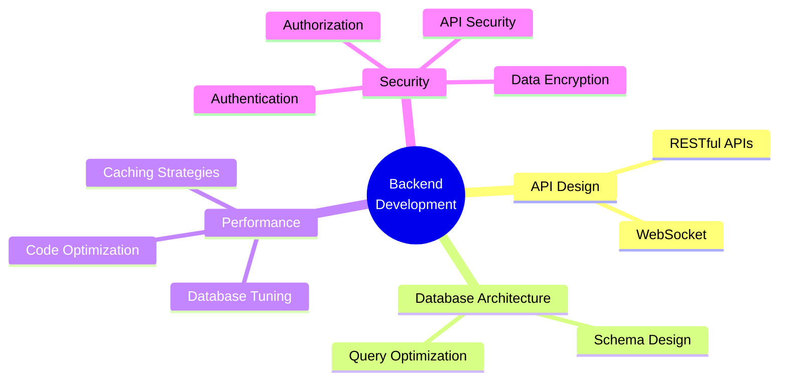

<div align="center">

#  SHIVAM KARN

```diff
@@                                              @@
+   ██████╗  █████╗  ██████╗██╗  ██╗███████╗███╗   ██╗██████╗   
+   ██╔══██╗██╔══██╗██╔════╝██║ ██╔╝██╔════╝████╗  ██║██╔══██╗  
+   ██████╔╝███████║██║     █████╔╝ █████╗  ██╔██╗ ██║██║  ██║  
+   ██╔══██╗██╔══██║██║     ██╔═██╗ ██╔══╝  ██║╚██╗██║██║  ██║  
+   ██████╔╝██║  ██║╚██████╗██║  ██╗███████╗██║ ╚████║██████╔╝  
+   ╚═════╝ ╚═╝  ╚═╝ ╚═════╝╚═╝  ╚═╝╚══════╝╚═╝  ╚═══╝╚═════╝   
+            ██████╗ ███████╗██╗   ██╗
+            ██╔══██╗██╔════╝██║   ██║
+            ██║  ██║█████╗  ██║   ██║
+            ██║  ██║██╔══╝  ╚██╗ ██╔╝
+            ██████╔╝███████╗ ╚████╔╝ 
+            ╚═════╝ ╚══════╝  ╚═══╝  
@@                                              @@
```


[](https://shivam-karn.com.np)
[](https://www.linkedin.com/in/shivamkarn1/)
[](https://x.com/ShivamKarnn)
[](mailto:shivamkarn767@gmail.com)

</div>

---

## 📊 GitHub Analytics Dashboard

<div align="center">

<table>
<tr>
<td width="50%" align="center">

### 📈 Contribution Stats


</td>
<td width="50%" align="center">

### 🏆 Achievement Showcase


### 💻 Code Distribution


</td>
</tr>
</table>

### 📉 Detailed Contribution Metrics


### 📊 Repository Analytics


### 📈 Comprehensive Profile Summary


</div>

---

## 🛠️ Technology Arsenal

<div align="center">

### Core Backend Stack

<table>
<tr>
<td align="center" width="100">

<br><strong>TypeScript</strong>
</td>
<td align="center" width="100">

<br><strong>JavaScript</strong>
</td>
<td align="center" width="100">

<br><strong>Node.js</strong>
</td>
<td align="center" width="100">

<br><strong>Express</strong>
</td>
</tr>
</table>

### Database & ORM Layer

<table>
<tr>
<td align="center" width="120">

<br><strong>MongoDB</strong>
<br><sub>NoSQL Database</sub>
</td>
<td align="center" width="120">

<br><strong>PostgreSQL</strong>
<br><sub>Relational DB</sub>
</td>
<td align="center" width="120">

<br><strong>Prisma ORM</strong>
<br><sub>Type-Safe ORM</sub>
</td>
<td align="center" width="120">

<br><strong>Drizzle ORM</strong>
<br><sub>Lightweight ORM</sub>
</td>
<td align="center" width="120">

<br><strong>Redis</strong>
<br><sub>Caching Layer</sub>
</td>
</tr>
</table>

### DevOps & Infrastructure

<table>
<tr>
<td align="center" width="140">

<br><strong>Docker</strong>
</td>
<td align="center" width="140">

<br><strong>Git</strong>
</td>
<td align="center" width="140">

<br><strong>GitHub</strong>
</td>
</tr>
</table>

### Development Environment

<table>
<tr>
<td align="center" width="140">

<br><strong>Arch Linux</strong>
<br><sub>Primary OS</sub>
</td>
<td align="center" width="140">

<br><strong>VS Code</strong>
<br><sub>Primary Editor</sub>
</td>
<td align="center" width="140">

<br><strong>Neovim</strong>
<br><sub>Secondary Editor</sub>
</td>
<td align="center" width="140">

<br><strong>Postman</strong>
<br><sub>API Testing</sub>
</td>
<td align="center" width="140">

<br><strong>Ghostty</strong>
<br><sub>Terminal</sub>
</td>
</tr>
</table>

</div>

---

## 💡 Core Knowledge

<div align="center">



</div>

<table align="center">
<tr>
<td align="center" width="25%">

### 🎯 API Architecture
- RESTful Design Patterns
- WebSocket Real-time
- Microservices Architecture
- API Versioning & Documentation

</td>
<td align="center" width="25%">

### 🗄️ Database Engineering
- Relational DB Design
- NoSQL Data Modeling
- Query Optimization
- Replication & Sharding

</td>
<td align="center" width="25%">

### ⚡ Performance Optimization
- Caching Mechanisms
- Database Tuning
- Memory Management
- Horizontal Scaling

</td>
<td align="center" width="25%">

### 🔒 Security & Best Practices
- JWT Authentication
- Role-Based Access Control
- Data Encryption
- Input Validation
- Security Auditing

</td>
</tr>
</table>

---

## 📈 Performance Metrics

<div align="center">

<table>
<tr>
<td align="center">

</td>
<td align="center">

</td>
<td align="center">

</td>
<td align="center">

</td>
</tr>
</table>


</div>

---

## 🤝 Let's Connect

<div align="center">

**Open to collaborating on backend projects, system design discussions, and open-source contributions!**

[](https://shivam-karn.com.np)
[](https://www.linkedin.com/in/shivamkarn1/)
[](https://x.com/ShivamKarnn)
[](mailto:shivamkarn767@gmail.com)


</div>
