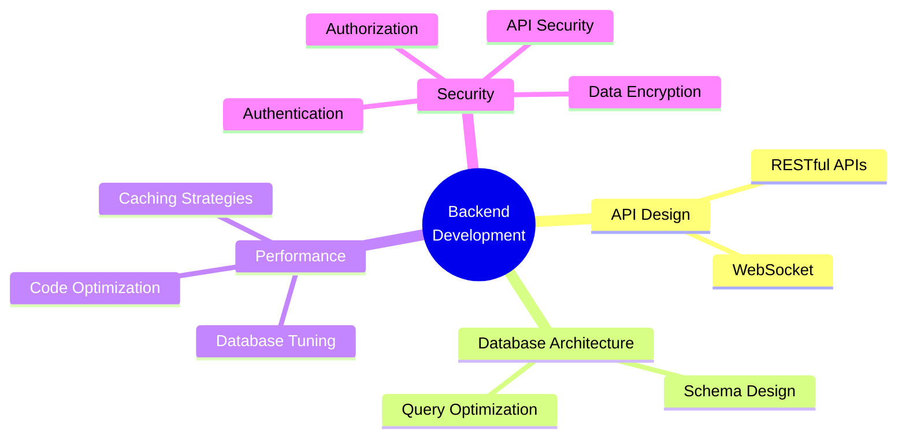

**Backend Developer | System Architect**  
**Node.js • TypeScript • PostgreSQL • MongoDB**  
**Building High-Performance Scalable Systems**

---

---

  

---

## 🛠️ Technology Arsenal

## Core Backend Stack

<table>
<tr>
<td align="center" width="100">

 <strong>TypeScript</strong>
</td>
<td align="center" width="100">

 <strong>JavaScript</strong>
</td>
<td align="center" width="100">

 <strong>Node.js</strong>
</td>
<td align="center" width="100">

 <strong>Express</strong>
</td>
</tr>
</table>

### Database & ORM Layer

<table>
<tr>
<td align="center" width="120">

 <strong>MongoDB</strong>
 NoSQL Database
</td>
<td align="center" width="120">

 <strong>PostgreSQL</strong>
 Relational DB
</td>
<td align="center" width="120">

 <strong>Prisma ORM</strong>
 Type-Safe ORM
</td>
<td align="center" width="120">

 <strong>Drizzle ORM</strong>
 Lightweight ORM
</td>
<td align="center" width="120">

 <strong>Redis</strong>
 Caching Layer
</td>
</tr>
</table>

### DevOps & Infrastructure

<table>
<tr>
<td align="center" width="140">

 <strong>Docker</strong>
</td>
<td align="center" width="140">

 <strong>Git</strong>
</td>
<td align="center" width="140">

 <strong>GitHub</strong>
</td>
</tr>
</table>

### Development Environment

<table>
<tr>
<td align="center" width="140">

 <strong>Arch Linux</strong>
 Primary OS
</td>
<td align="center" width="140">

 <strong>VS Code</strong>
 Primary Editor
</td>
<td align="center" width="140">

 <strong>Neovim</strong>
 Secondary Editor
</td>
<td align="center" width="140">

 <strong>Postman</strong>
 API Testing
</td>
<td align="center" width="140">

 <strong>Ghostty & Tmux</strong>
 Terminal
</td>
</tr>
</table>

---

## 💡 Core Knowledge

## 📊 GitHub Analytics Dashboard

<table>
<tr>
<td width="100%" align="center">

</td>
</tr>
</table>

## 📊  Repository Analytics

  
  

### 📈 Comprehensive Profile Summary

  

---
